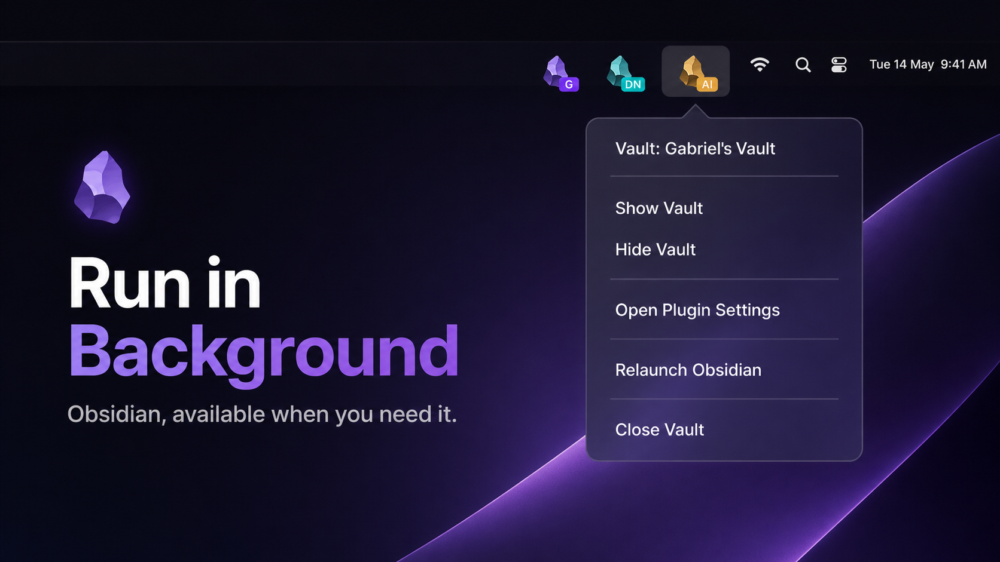

# Run in Background



Keep desktop Obsidian vaults—and Obsidian Sync—available in the background
without blocking logout, restart, or operating-system shutdown.

Closing a vault window can hide it instead of terminating it. Restore it from
the Dock or taskbar, by launching Obsidian again, or from a vault-specific tray
icon. Normal Quit behavior remains independently configurable.

This is especially useful when you want Obsidian Sync to keep processing
changes while the vault window is hidden. Run in Background does not replace
Obsidian Sync and cannot sync while the computer is asleep or offline.

## Highlights

- Keep one or several vaults running in the macOS menu bar or system tray.
- Let Obsidian Sync continue working while vault windows are hidden.
- Restore hidden vaults by activating Obsidian or selecting **Show Vault**.
- Optionally make Cmd+Q or the normal Quit command hide instead of terminate.
- Always allow explicit Close Vault, Relaunch, logout, restart, and shutdown.
- Distinguish vaults with custom icons and optional colored text, number,
  symbol, or emoji badges of up to three characters.
- Open the plugin settings directly from the tray menu.
- Import compatible settings from the original Tray plugin on first launch.

Run in Background is desktop-only and makes no network requests.

## Window and quit behavior

| Action | Default behavior |
| --- | --- |
| Close a vault window | Hide the vault and keep it running |
| Cmd+Q / normal Quit | Hide the vault and keep it running |
| Tray **Close Vault** | Close that vault |
| **Relaunch Obsidian** | Exit and relaunch cleanly |
| Disable the plugin | Remove listeners and tray objects cleanly |
| Logout, restart, or shutdown | Exit without blocking the operating system |

The two background behaviors have separate toggles, so window closing and the
Quit command can be configured independently.

## Settings

| Setting | Description | New-install default |
| --- | --- | --- |
| Enable Run in Background | Master switch for all plugin runtime behavior | On |
| Launch on startup | Launch Obsidian when you sign in | Off |
| Hide on launch | Start the vault hidden | On |
| Run in background | Hide an ordinary window close | On |
| Keep running after Quit command | Turn Cmd+Q / Quit into hide | On |
| Hide Dock/taskbar icon | Remove Obsidian from the Dock or taskbar | Off |
| Create tray icon | Create the vault menu-bar or tray icon | On |
| Tray icon image | Select a preset or upload a square PNG/SVG | Obsidian |
| Vault badge | Add up to three characters, optionally separated by spaces | Vault initials |
| Badge color | Set a vault-specific badge background with automatic contrast | Dark |

For safety, hiding the Dock/taskbar icon keeps the tray icon enabled. Disabling
the tray icon restores the Dock/taskbar icon.

The top **Enable Run in Background** switch deactivates the entire runtime
without disabling the community plugin. While it is off, no close or Quit
behavior, tray icon, Dock/taskbar changes, or launch-at-login behavior remains
active; the settings page stays available so you can turn it back on.

## Installation

### Community Plugins

After publication, open **Settings → Community plugins → Browse**, search for
**Run in Background**, select it, and choose **Install**, then **Enable**.

### BRAT

Before community publication, install
[BRAT](https://obsidian.md/plugins?id=obsidian42-brat), choose **Add beta
plugin**, and enter:

```text
gabrielbacha/run-in-background
```

### Manual installation

Download `main.js`, `manifest.json`, and `styles.css` from a matching
[GitHub release](https://github.com/gabrielbacha/run-in-background/releases),
then place them in:

```text
<vault>/.obsidian/plugins/run-in-background/
```

Reload Obsidian and enable **Run in Background** under Community plugins.

## Using the tray menu

Each vault menu contains:

- **Show Vault** and **Hide Vault**
- **Open Plugin Settings**
- **Relaunch Obsidian**
- **Close Vault**

The menu header and tooltip identify the active vault as `Vault: <name>`.

## Troubleshooting

### The vault is running but no window is visible

Click Obsidian in the Dock/taskbar, launch Obsidian again, or choose **Show
Vault** from its tray menu.

### Cmd+Q does not terminate Obsidian

Disable **Keep running after Quit command**, or use **Close Vault** from the
tray menu. Logout, restart, and shutdown always bypass this setting.

### I cannot find either the Dock icon or tray icon

Run in Background prevents this combination in its own settings. Launch
Obsidian again to restore the vault if another application or macOS preference
temporarily hides the icons.

## Development and releases

See [CONTRIBUTING.md](CONTRIBUTING.md) for setup, verification, pull-request,
and release instructions. Report vulnerabilities privately through the
repository's GitHub Security Advisories.

## Attribution and license

Run in Background is a maintained fork of
[dragonwocky/obsidian-tray](https://github.com/dragonwocky/obsidian-tray),
originally created by dragonwocky. The original project and this fork are
distributed under the [MIT License](LICENSE).

The Obsidian name and logo are trademarks of Obsidian. The bundled logo is
used to identify Obsidian and follows the
[Obsidian brand guidelines](https://obsidian.md/brand).
